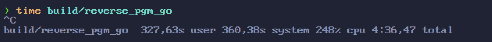
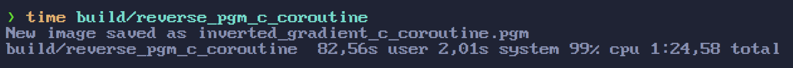
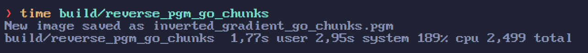
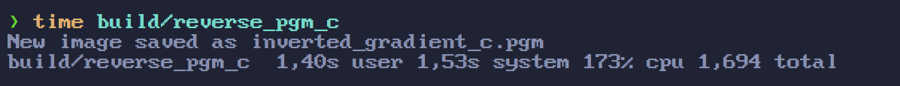
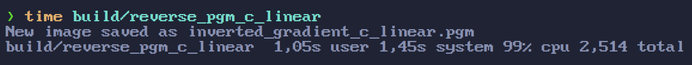
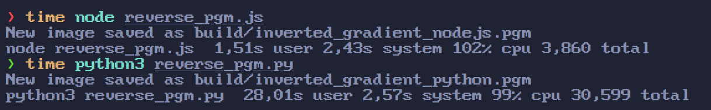

# Parallelism concepts

This is a summary of the most common parallelism concepts that I know of and serves as a consolidation of my knowledge about this topic.

## Concurrency vs Parallelism

**Concurrency** is like pin juggling, one person (CPU core) executing several tasks (pins) by rapidly switching between them to keep all the pins in the air.

**Parallelism** is like horse racing, each horse (CPU core) executes
one task (running) at the same time.

## MapReduce

[MapReduce](https://en.wikipedia.org/wiki/MapReduce) is a programming model to handle big data. The main idea is to use several computers in parallel to process large amounts of data, by first transforming that data (mapping) then reducing to a desired output.

## Dataflow

[Dataflow](https://en.wikipedia.org/wiki/Dataflow_programming) is a programming paradigm for dealing with state where each operation changes the state sequentially thus removing the need for locks or other mechanisms for handling shared state problems in parallel code. Most commonly found in functional languages like [Clojure async package](https://clojure.org/reference/async).

My notes: Must be implemented on the language level and is not performant. This is also related to persistent data structures and immutability. It does make it easy to deal with parallel code but I don't think it is worth it performance wise.

## Transactional memory

[Transactional memory](https://en.wikipedia.org/wiki/Transactional_memory) is a way to add transactions in a specific block of code. Is the same idea of database transactions.

My notes: Can't think of any real world use case for this and couldn't find any examples online.

## IPC - Shared Memory

[IPC - Shared Memory](https://www.geeksforgeeks.org/ipc-shared-memory/) is a way to communicate between two different processes using shared memory.

My notes: Can't think of any real world use case for this and couldn't find any examples online.

## IPC - Message Passing

[IPC - Message Passing](https://www.geeksforgeeks.org/inter-process-communication-ipc/) is a way to communicate between two different processes using messages.

My notes: Can't think of any real world use case for this and couldn't find any examples online.

From my understanding the goal should be to only have one process running (your program). Think about a server hosted on a machine in a cloud service. Creating another process on that machine will consume memory and CPU power that could be better used for your main server process.

## Threads VS Goroutines

When you start learning Go and Goroutines, you eventually wonder what is the difference between a thread and a Goroutine.
Probably most content on the internet will say that is expensive to create and manage threads, which is true, and show
how Goroutine has a better solution, since it is lightweight.

One website defines the benefit of a Goroutine like this:

> It's extremely cheap to create and use goroutines compared to creating and working with threads. Goroutines are a few kilobytes in size and the stack can grow and shrink according to the needs of the application. On the other hand, thread stack size is fixed and it cannot grow and shrink.

This mentality is similar to manual memory management, where you are taught to use only what you need, otherwise you would be wasting resources. The truth is that this idea makes sense in a small environment, but in the real world you want to maximize the resource usage.

To exemplify this, I created program `pgm.c` that creates a gradient image file of one 1GB. I used the PGM file format since it is a really simple format to write on disk.
Then, I created a five programs with different strategies that reverse the color of each pixel of the image.

I used the `time` command on linux to compare the time and CPU usage of each solution. The total time is the user and system combined.

My first approach for the Go code was to create a Goroutine for each pixel of the image. I think is fair to assume that the average Go developer will use this approach, since the scheduler will determine the amount of threads to use, therefore you can't be sure of how many Goroutines are necessary to split the workload efficiently.

Go results:


It simply took too long to finish, so I had to kill the process.
Clearly not a viable solution.

I used the same approach using a coroutine library for C code.



It takes some time and finishes in 1 minute and 24 seconds. Very inefficient.

My second approach for the Go code was to divide the workload
evenly by the number of threads that my computer support. The scheduler
is still responsible for distributing the goroutines.



Now it takes less than 5 seconds.

I used the same approach for the C code.



It took less than 3 seconds.

For my final approach I created the simplest solution, which is to
iterate each pixel without using any threads or coroutines.



Amazing! It takes 2.5 seconds and is faster than the multithread code!

Conclusion: If you want speed, C is the Go-to language 😉.

PS: Here is a comparison between Nodejs and Python



Python is **really slow** and Nodejs is heavily optimized. 

## CSP (channels / goroutines)

It seems that [Communicating sequential processes](https://en.wikipedia.org/wiki/Communicating_sequential_processes) is a wide topic but can be [narrowed down to channels and goroutines](https://www.youtube.com/watch?v=zJd7Dvg3XCk).

The main idea is to have a queue where each goroutine can send data and read asynchronously.

## Producer-Consumer problem

When you have one or several producers and one or several consumers that communicate with a single shared data.

My notes: you can use channels or a circular buffer to solve this.

## Circular buffer

[Circular buffer](https://en.wikipedia.org/wiki/Circular_buffer)
is a data structure that can be used for communication between
producers and consumers.

[Handmade Hero - Implementation in C for rendering chunks of graphics](https://guide.handmadehero.org/code/day126/)

## Readers-Writers problem

[Article about the different cases of readers-writers problem](https://www.baeldung.com/cs/readers-writers-problem). AFAIK the only use case is for a database (SQLite uses this approach) where several threads can read the data at the same time but only the writer will lock the data.

My notes: this seems the most sensible solution if you ever need this type of feature.

## Actor Model

[Actor model](https://en.wikipedia.org/wiki/Actor_model)
is a computing model where the building block is an actor
that has a local state, can receive and send messages and create other actors. You can think as each actor having a mailbox (queue/channel) of messages.

Erlang is built on this entire model.

My notes: it seems similar to Goroutines, where the main idea is to have several actors running. I fail to see if this is really
relevant compared to a simpler approach of creating the threads that you need beforehand and streaming the data to these threads.
Another concept related to Actors is a Supervisor, which can take different actions based on the failure of an actor. I don't know if you really need actors to implement this behavior. I suspect that you don't and the whole idea of actors seems a little overrated for praising high availability.

## Busy wait / Spinlock

Is simply a loop where you run forever and check everytime for
a change in some data.

Read more on [Wikipedia about Busy Wait](https://en.wikipedia.org/wiki/Busy_waiting), [Spinlock on Wikipedia](https://en.wikipedia.org/wiki/Spinlock) and [Spinlock on StackOverflow](https://stackoverflow.com/questions/1957398/what-exactly-are-spin-locks)

```c
while(is_resource_locked(resource)) {
  // now you are busy (checking the resource)
  // but is still waiting for the resource to be unlocked

  // I'm busy doing nothing!
  // Try spinning, its a good trick!
}

// my time has come!
lock();
resource = new_value;
unlock();
```

## Atomic types

[C has _Atomic keyword](https://en.cppreference.com/w/c/language/atomic) for ensuring that the data can be modified without worrying about race conditions. Only primitive types are supported.

## Mutex

[Mutex](https://en.wikipedia.org/wiki/Mutual_exclusion) is a lock mechanism for ensuring that only one thread can execute a block of code or modify a value.

## Semaphore

[Semaphore](https://en.wikipedia.org/wiki/Semaphore_(programming)) is a mechanism to control access by multiple threads. Can be binary or counter.

[Semaphore vs Mutex](https://www.baeldung.com/cs/semaphore-vs-mutex#semaphore-vs-mutex)

## Non-blocking IO / AIO (Async IO)

[Types of IO explained](https://stackoverflow.com/a/40049018)

In simple terms, non-blocking IO is single threaded and AIO is multithread non-blocking IO.

## SIMD / SWAR

[SIMD](https://en.wikipedia.org/wiki/Single_instruction,_multiple_data) is way to execute a single instruction on multiple data. You can think as doing a `map` operation in parallel on an array of values.

[SWAR](https://en.wikipedia.org/wiki/SWAR) is the same idea of SIMD, but instead of using a dedicated register for this operation, you interpret the data the way you want. You could pack 4 8-bit integers in a 32-bit integer (using an arithmetic shift), do the operation and then extract the values.

## Compute Shader

Compute shader is a way to leverage the GPU to do arbitrary computations. It is often used when you are already using an
graphics API like OpenGL or Vulkan inside your program.

[Compute Shader in OpenGL](https://learnopengl.com/Guest-Articles/2022/Compute-Shaders/Introduction)

[Compute Shader in Vulkan](https://vkguide.dev/docs/gpudriven/compute_shaders/)

## GPGPU

[GPGPU](https://en.wikipedia.org/wiki/General-purpose_computing_on_graphics_processing_units) is a way to leverage the GPU to do arbitrary computations.

[OpenCL](https://en.wikipedia.org/wiki/OpenCL) is a framework
for doing this and is cross-platform (works with NVidia an AMD).

[CUDA](https://en.wikipedia.org/wiki/CUDA) is specific for NVidia

[ROCm](https://en.wikipedia.org/wiki/ROCm) is specific for AMD

## ISPC

[An open-source compiler for high-performance SIMD programming on the CPU and GPU](https://ispc.github.io/documentation.html).
Similar to C syntax.