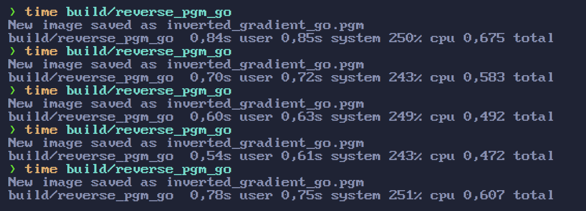
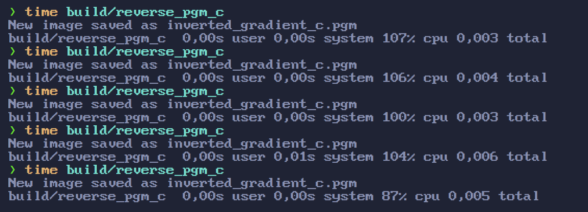
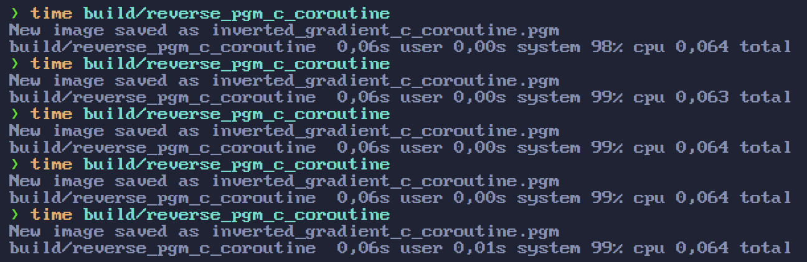

# Parallelism concepts

This is a summary of the most common parallelism concepts that I know of and serves as a consolidation of my knowledge about this topic.

## Concurrency vs Parallelism

> **Concurrency** is like pin juggling, one person (CPU core) executing several tasks (pins) by rapidly switching between them to keep all the pins in the air.

> **Parallelism** is like horse racing, each horse (CPU core) executes
one task (running) at the same time.

## MapReduce

[MapReduce](https://en.wikipedia.org/wiki/MapReduce) is a programming model to handle big data. The main idea is to use several computers in parallel to process large amounts of data, by first transforming that data (mapping) then reducing to a desired output.

## Dataflow

[Dataflow](https://en.wikipedia.org/wiki/Dataflow_programming) is a programming paradigm for dealing with state where each operation changes the state sequentially thus removing the need for locks or other mechanisms for handling shared state problems in parallel code. Most commonly found in functional languages like [Clojure async package](https://clojure.org/reference/async).

My notes: Must be implemented on the language level and is not performant. This is also related to persistent data structures and immutability. It does make it easy to deal with parallel code but I don't think it is worth it performance wise. Can't think of any real world use case for this and couldn't find any examples online.

## Transactional memory

[Transactional memory](https://en.wikipedia.org/wiki/Transactional_memory) is a way to add transactions in a specific block of code. Is the same idea of database transactions.

My notes: Can't think of any real world use case for this and couldn't find any examples online.

## IPC - Shared Memory

[IPC - Shared Memory](https://www.geeksforgeeks.org/ipc-shared-memory/) is a way to communicate between two different processes.

My notes: Can't think of any real world use case for this and couldn't find any examples online.

## IPC - Message Passing

[IPC - Message Passing](https://www.geeksforgeeks.org/inter-process-communication-ipc/) is a way to communicate between two different processes.

My notes: Can't think of any real world use case for this and couldn't find any examples online.

From my understanding the goal should be to only have one process running (your program). Think about a server hosted on a machine of a cloud service. Creating another process on that machine will consume memory and cpu power that could be better used for your main server process.

## Threads VS Goroutines

When you start learning Go and Goroutines, you eventually wonder what is the difference between a thread and a Goroutine.
Probably most content on the internet will say that is expensive to create and manage threads, which is true, and show
how Goroutine has a better solution, since it is lightweight.

One website defines the benefit of a Goroutine like this:

> It's extremely cheap to create and use goroutines compared to creating and working with threads. Goroutines are a few kilobytes in size and the stack can grow and shrink according to the needs of the application. On the other hand, thread stack size is fixed and it cannot grow and shrink.

This mentality is similar to manual memory management, where you are taught to use only what you need, otherwise you would be wasting resources. The truth is that this idea makes sense in a small environment, but in the real world you want to maximize the resource usage.

To exemplify this, I created program `pgm.c` that creates a gradient image file with 1000 by 1000 pixels. PGM is a really simple image file format.
Then, I created a `reverse_pgm.c` and `reverse_pgm.go` that reads this image and invert the pixel color.

My approach for the Go code was to create a Goroutine for each pixel of the image. For the C code, my approach was to divide
the image in chunk based on the number of CPU cores available.

I used the `time` command on linux to compare the time and CPU usage.

Go results:

C results:

The C code executes instantly and the Go code takes a little bit of time and more than double of CPU usage. I couldn't find a way to measure the memory used by each program, but I can infer that Go uses more memory since each Goroutine needs its own stack.

What if you had Coroutines in C?

C Coroutines results:

It is still way faster than Go.

Is the garbage collector the cause of sloweness?
I tried with `debug.SetGCPercent(-1)` to disable it
but had no difference on performance.

So probably the root cause is the difference between scheduler implementations.

You can read more about the [Neco scheduler on Github](https://github.com/tidwall/neco#the-scheduler).

You can read more about the [Go scheduler on Github](https://github.com/golang/go/blob/b788e91badd523e5bb0fc8d50cd76b8ae04ffb20/src/runtime/proc.go#L22-L114)

Conclusion: For now I cannot think of any situation where it would be desirable to have Goroutines (or Coroutines), and if you want speed, C is the Go to language 😉.

## CSP (channels / goroutines)

It seems that [Communicating sequential processes](https://en.wikipedia.org/wiki/Communicating_sequential_processes) is a wide topic but can be [narrowed down to channels and goroutines](https://www.youtube.com/watch?v=zJd7Dvg3XCk).

The main idea is to have a queue where each goroutine can send data and read asynchronously. It seems similar to a circular buffer when you have one producer and several readers.

TODO: compare channels with circular buffer.

## Circular buffer (producer / consumer problem)

## Readers / Writers problem?

Only writers block

## Actor Model

TODO

## Busy wait / spin lock

## Atomic

Only primitive types.

## Mutex

TODO

## Semaphore (wait group?)

TODO

## Non-blocking IO / AIO (Async IO)

TODO

## SIMD / OpenCL / CUDA / ISPC / Shader Compute (Vulkan / GLSL / HSLS)

TODO